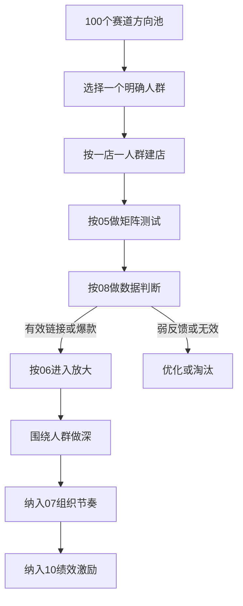

# POD 整体运营方案

> 本文档是本仓库的总纲文件。它不替代各分册，而是把现有认知、店铺规则、赛道池、矩阵铺货、三阶段执行、数据判断、组织机制与绩效制度整合成一套统一的经营方案。  
> 细节执行分别见 `01-核心认知与商业模型.md`、`02-店铺分层架构.md`、`05-矩阵铺货标准流程.md`、`06-三阶段执行手册.md`、`07-团队分工与考核指标.md`、`08-数据筛选规则.md`、`10-运营绩效与提成制度.md`、`12-100个赛道方向.md`。

---

## 一、这套模式到底在做什么

我们做的不是“多上点链接，总会撞到爆款”。

我们做的是：

**围绕一个具体人群，持续产出能让他下单的表达。**

POD 的本质不是卖一件 T 恤，而是卖：

- 身份标签
- 情绪共鸣
- 场景表达
- 送礼理由

因此，这套模式的目标不是单纯提高上架量，而是把团队从“泛铺撞款”切换到：

**人群资产池 + 情绪表达矩阵 + 数据驱动放大**

一句话总结：

```text
明确人群 × 情绪共鸣 × 具体场景 × 可复制表达 = 好的 POD
```

---

## 二、总前置条件

在讨论任何赛道、设计、店铺、铺货节奏之前，先过一个前提：

> **这个人群，或者为这个人群付钱的人，是否真的会在我们的平台上买印花 T 恤？**

必须同时满足三个条件：

1. **有线上消费习惯**：目标买家本来就在 TikTok Shop、Shopee、Temu、Etsy、Amazon 这类平台消费。
2. **有穿印花 T 恤表达身份的文化**：这个群体会把身份、情绪、关系、兴趣穿在身上。
3. **买得起且愿意买**：不是“有钱”就够，而是这类人真的愿意为这种表达付钱。

要特别注意：

**真正的买家不一定是穿着者。**

很多赛道的核心买家是：

- 配偶
- 家人
- 朋友
- 同事

所以我们判断赛道时，必须同时看：

- 谁穿
- 谁付钱
- 谁在平台上购物

不满足这个前置条件的方向，不进入我们的测试池。

---

## 三、整体经营模型

整个业务只做一件事：

**从赛道池里选出能稳定出单的人群方向，然后围绕这个人群持续做深。**

总链路如下：



这个模型里有四个核心对象：

| 对象 | 定义 | 作用 |
| --- | --- | --- |
| **赛道** | 一类有购买可能的人群方向 | 提供选品起点 |
| **人群** | 一个具体、可表达、可扩展的购买群体 | 是经营基本单位 |
| **店铺** | 一个固定人群的资产池 | 承载这个人群的全部表达 |
| **链接** | 这个人群下的某一种表达 | 是被测试、被筛选、被放大的最小单位 |

所以：

- `12-100个赛道方向.md` 解决的是“做什么方向”
- `02-店铺分层架构.md` 解决的是“这个方向放到哪个店”
- `05-矩阵铺货标准流程.md` 解决的是“怎么把方向拆成款”
- `08-数据筛选规则.md` 解决的是“哪些链接该留、该放大、该淘汰”

---

## 四、店铺、人群、赛道的配置规则

### 1. 一个店铺 = 一个人群方向

从开店第一天起，一个店就只服务一个明确人群。

不是：

- 一个店放很多赛道
- 一个店同时测很多不相关人群
- 先开店再慢慢想放什么

而是：

1. 先确定人群
2. 再开店绑定这个人群
3. 在这个人群内部测试不同表达
4. 用数据判断这个人群是否值得深耕

### 2. 测试的是表达，不是人群

测试期真正要测的是：

- 搞笑还是温馨
- 极简还是插画
- 英文还是双语
- 礼物场景还是日常场景

不是在一个店里同时试：

- 宠物
- 职业
- 家庭关系
- 兴趣爱好

这种做法本质上还是泛铺。

### 3. 多店铺的意义

多店铺不是为了“多开几家碰碰运气”。

多店铺的意义是：

**多店铺 = 多个人群资产池**

每一个店都应该有清晰定位：

- 这个店是给谁开的
- 这个店里应该出现什么表达
- 哪些设计不属于这个店

---

## 五、100 个赛道方向在整体方案里的位置

`12-100个赛道方向.md` 已经不是一份零散灵感表，而是整个经营体系里的上游赛道池。

它的定位必须明确为四件事：

1. **赛道备选池**：提供可优先测试的人群方向。
2. **文案灵感库**：提供不同情绪、不同场景的表达参考。
3. **视觉参考库**：通过 Pinterest 关键词帮助统一风格探索。
4. **趋势与季节提示库**：帮助我们安排周计划和月计划。

它不是：

- KPI 清单
- 铺货任务表
- 要求每个人全部做完的待办池

在整体运营里，`12` 的正确用法是：

```text
从 12 里选方向
→ 按 05 做矩阵展开
→ 按 08 看数据
→ 符合 06 的阶段节奏就放大
→ 最后进入 07 / 10 的组织与绩效口径
```

### 赛道池的使用纪律

1. 每次只选择少量方向进入测试，不同时铺开过多赛道。
2. 赛道是否继续，只看数据，不看“我觉得这个方向不错”。
3. `12` 中的“为什么适合”只是入池理由，不等于必爆保证。
4. `12` 中的文案和 Pinterest 关键词是起点，不是照抄模板。

---

## 六、标准执行 SOP

### 第一步：选方向

从 `03`、`04`、`12` 中选出一个具体人群方向，先过前置条件：

- 平台人群匹配吗
- 会穿这种 T 恤吗
- 真正的买家是谁

### 第二步：做矩阵

围绕同一个人群，从四个维度展开：

- 情绪
- 风格
- 语言
- 场景

目的不是凑数量，而是系统化覆盖这个人群可能会买单的表达。

### 第三步：出设计和链接

按 `05` 执行：

- 文字款优先
- 插画要直接贴合人群
- 标题、标签、主图都围绕人群关键词
- 每个链接必须可追溯到赛道、情绪、风格和上架日期

### 第四步：分批上架

不要一口气全部上完。

推荐做法：

- 每天分批上架
- 让每批链接都能吃到平台新品窗口
- 上架同时进入数据记录表

### 第五步：进入数据观察

上架后立刻进入标准观察节奏：

| 时间节点 | 重点看什么 | 经营动作 |
| --- | --- | --- |
| 第 1-3 天 | 曝光、点击 | 改标题、标签、主图 |
| 第 4-7 天 | 收藏、加购、出单 | 判断是否有兴趣信号 |
| 第 7-14 天 | 持续出单 | 判定是否有效链接、是否进入放大 |

---

## 七、三阶段经营节奏

### 阶段一：测试期

目标是：

**用最小成本验证一个人群方向值不值得继续做。**

测试期看三件事：

1. 这个人群有没有点击
2. 这个人群有没有下单
3. 这个赛道里哪种表达最容易起量

测试期纪律：

- 不追求完美设计
- 不一次性测太多方向
- 不靠感觉判断去留
- 不在测试期急着投广告

### 阶段二：放大期

当某些链接已经证明“这个方向有人买”，就进入放大。

放大的四个动作：

1. 做变体
2. 围绕这个人群持续加深
3. 跨平台分发
4. 用小预算流量配合放大

放大期的核心不是重新换赛道，而是：

**在同一个人群里，把已经验证过的表达继续做大。**

### 阶段三：做深期

当一个方向持续稳定出单后，目标就不再是“继续试”，而是：

**把这个人群做成店铺壁垒。**

做深期要做两件事：

1. **系列化**：按情绪、场景、风格、子人群组织款式
2. **视觉统一**：让用户一进店就知道这是为哪类人开的店

---

## 八、数据判断和经营动作

所有经营动作都必须和 `08-数据筛选规则.md` 对齐。

### 最简经营口径

先看“链接到底能不能卖”：

- **起单信号**：14 天内出 1 单
- **有效链接**：14 天内至少 2 单，且分布在 2 天及以上
- **无效链接**：30 天 0 单
- **量起来**：连续 7 天累计 10+ 单，或连续 3 天都有单

### 完整经营口径

当数据能力足够时，再按 S/A/B/C 管理链接：

| 分级 | 含义 | 动作 |
| --- | --- | --- |
| **S 级** | 持续出单的爆款 | 立即做变体、跨平台、放量 |
| **A 级** | 有单但不稳定 | 优化后继续观察 |
| **B 级** | 有点击或收藏但没出单 | 一次只改一个变量，最多两轮 |
| **C 级** | 无反应 | 淘汰 |

### 赛道级判断

除了看单条链接，我们还要看赛道健康度：

- 首批测试款里有多少 S/A 级
- 7 天内总出单情况如何
- 整体点击率是否过线

赛道层面的结论只允许三种：

1. **继续放大**
2. **继续补测**
3. **停止投入**

不要出现第四种状态：

**明明没有数据，还一直靠主观感觉拖着不结束。**

---

## 九、组织运行机制

当前默认模式是：

**模式 D：全员独立作战**

也就是：

- 每个人负责自己的店铺和链接
- 同一产品可多平台上架
- 不按平台拆岗
- 不按研究、铺货、数据拆成流水线

### 主管的职责

主管不替运营决定今天做什么赛道，而是负责：

- 收三问周报
- 汇总各运营有效链接、爆款、命中率
- 追问糊弄式汇报
- 做透明排名
- 在周会上统一规则与复盘

### 运营的职责

运营负责：

- 选方向
- 做矩阵
- 出图
- 上架
- 看数据
- 优化、淘汰、放大

也就是说，运营不是单纯的“铺货执行员”，而是一个完整经营单元的负责人。

---

## 十、周节奏与月节奏

### 日常节奏

每天至少完成三类动作：

1. 上新或做变体
2. 回看近 7 天数据
3. 记录当日判断和下一步动作

### 周节奏

每周必须完成：

1. **周一三问周报**
   - 上周上了多少链接，哪些出单
   - 哪条卖得最好，为什么
   - 这周准备做什么方向，为什么
2. **主管周二汇总**
   - 有效链接
   - 爆款
   - 命中率
   - 趋势变化
3. **周会复盘**
   - 哪些赛道值得加码
   - 哪些赛道该停
   - 哪些表达已经验证

### 月节奏

每月初做一次月度复盘：

- 每个运营的有效链接、爆款、命中率
- 各赛道的阶段分布
- 哪些赛道进入做深
- 哪些方向连续两周或一个月没有结果，需要退出

---

## 十一、绩效和经营结果怎么挂钩

绩效制度必须服务经营，而不是反过来把团队带回“无效铺量”。

所以我们的指挥棒必须统一为：

1. **有效链接数**
2. **爆款数**
3. **选品命中率**
4. **毛利结果**

上架量只作为过渡期劳动纪律，不作为核心奖励目标。

绩效逻辑是：

- `08` 定义什么叫有效链接、什么叫爆款
- `07` 定义谁负责、怎么收数、怎么排名
- `10` 定义怎么发绩效、提成和专项奖

这三者必须永远使用同一套口径。

---

## 十二、两条业务线如何落到这套方案里

### 菲律宾线

平台：

- TikTok Shop
- Shopee
- Temu 半托管

特点：

- 买家更年轻
- 更容易自穿
- 本地语言、关系表达、自嘲内容更有传播性

适合围绕：

- 职业
- 家庭称呼
- 本地流行文化
- 年轻兴趣圈层

### 欧美线

平台：

- Temu 全托管
- Etsy
- Amazon Merch

特点：

- 礼物场景更重
- 宠物、职业、家庭、兴趣细分更成熟
- 文案通常更直给，身份标签更明确

适合围绕：

- 宠物品种
- 家庭角色
- 职业身份
- 兴趣生活方式

两条线文化不同，但经营逻辑完全一致：

**都必须先找到会买的人，再做能让这类人下单的表达。**

---

## 十三、执行纪律和禁区

### 必须坚持的纪律

1. 先选人群，再开店
2. 一个店只做一个人群
3. 先有自然反馈，再谈放量
4. 一次只改一个变量
5. 判断去留时只看数据，不看自我感动

### 明确禁止的做法

1. 在一个店里同时测多个不相关人群
2. 把 `12-100个赛道方向.md` 当成“铺货任务清单”
3. 因为某个赛道听上去不错，就长期拖着不淘汰
4. 测试期直接跳到做深期
5. 把上架量当成经营成功本身

---

## 十四、文档分工与阅读顺序

如果只想快速理解全局，阅读顺序如下：

1. `11-整体运营方案.md`
2. `01-核心认知与商业模型.md`
3. `02-店铺分层架构.md`
4. `05-矩阵铺货标准流程.md`
5. `08-数据筛选规则.md`
6. `07-团队分工与考核指标.md`
7. `10-运营绩效与提成制度.md`
8. `12-100个赛道方向.md`

其中：

- `11` 解决“整体怎么运转”
- `01` 解决“为什么这么做”
- `02` 解决“店铺怎么放”
- `05` 解决“赛道怎么拆成款”
- `08` 解决“数据怎么判断”
- `07/10` 解决“组织和激励怎么运转”
- `12` 解决“接下来优先测什么方向”

---

## 十五、最后一句话

这套体系的核心，不是比谁铺得多，而是比谁更快找到：

**会在平台上买 T 恤的人群，和这群人愿意买单的表达。**

找到之后，不是换方向乱跑，而是围绕这个人群持续做深。

这才是我们这套 POD 运营模式的真正目标。
